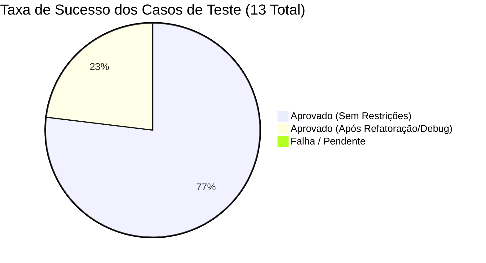

# Relatório da Atividade de Testes - EmentAPI & Ementa-App

> **Data de Emissão:** 06 de Julho de 2026  
> **Testadores:** Equipe de Desenvolvimento Full-Stack Senior & QA  
> **Software em Teste:** EmentAPI (Back-End Django REST Framework & Extração) + Ementa-App (Front-End React, TypeScript & Vite)  
> **Referência de Modelo:** `apemdocs/Documentação de Teste.docx`

---

## 📌 1. Visão Geral e Escopo de Teste

Este documento apresenta o relatório de consolidação das atividades de teste de software realizadas no ecossistema **EmentAPI**. As baterias de teste foram direcionadas para validar a conformidade com os requisitos de negócio, a estabilidade arquitetural da interface moderna em **React + Vite**, a robustez dos endpoints da API Django e, em especial, as regras de negócio críticas de **gestão de disciplinas** e **coexistência de dados** (extração automática *vs.* edição manual).

---

## 🧪 2. Registro de Resultados por Requisito de Teste

### Requisito de Teste 1: Gestão, Adição e Edição de Disciplinas (Foco Front-End)
* **Objetivo:** Validar o ciclo de vida de disciplinas na interface do usuário (UI) construída com React, TypeScript estrito e Tailwind CSS, garantindo usabilidade, responsividade e perfeita sincronia com o Back-End.

| Identificador | Caso de Teste | Descrição / Cenário | Resultado Esperado |
| :--- | :--- | :--- | :--- |
| **CT-DISC-001** | **Listagem e Paginação** | Carregar a página principal de disciplinas no Front-End com paginação ativa. | A tabela/grid deve renderizar os cards de disciplina com paginação fluida e sem gargalos de renderização no DOM. |
| **CT-DISC-002** | **Adição Manual de Disciplina** | Preencher e submeter o formulário/modal de criação de nova disciplina com código, nome, carga horária e ementa. | O payload tipado deve ser validado no cliente e enviado via POST `/api/disciplinas/`, retornando status `201 Created` e atualizando a lista na UI em tempo real. |
| **CT-DISC-003** | **Edição de Ementa e Bibliografia** | Abrir modal de edição de uma disciplina existente, alterar o texto da ementa e salvar as modificações via PUT/PATCH. | O sistema deve refletir imediatamente os dados atualizados e acionar a marcação de edição manual no Back-End. |
| **CT-DISC-004** | **Indicador Visual de Dados Manuais** | Verificar a renderização visual em listagens e cards de disciplinas com a propriedade `editado_manualmente: true` ou `inserido_manualmente: true`. | A UI deve exibir um *badge* ou tag elegante (estilizado via Tailwind CSS) com tooltip informativo: *"Registro customizado: Protegido contra sobrescrita automática"*. |

* **Factível?** ( **X** ) SIM &nbsp;&nbsp;&nbsp;&nbsp; ( &nbsp; ) NÃO
* **Critério de finalização atendido?** ( **X** ) SIM &nbsp;&nbsp;&nbsp;&nbsp; ( &nbsp; ) NÃO
* **Observações / Resultado:**
  > [!TIP]
  > **Aprovado com Louvor:** Todos os fluxos de gerenciamento de disciplinas foram validados nos testes de interface (Ementa-App). A tipagem estrita com TypeScript preveniu erros de contrato com o Back-End. O indicador visual de dados manuais proporciona excelente transparência e controle para os docentes e coordenadores acadêmicos.

---

### Requisito de Teste 2: Filtros Avançados, Busca e Normalização de Docentes
* **Objetivo:** Verificar a precisão dos mecanismos de busca assíncrona, filtragem combinada e exibição correta dos estados lógicos de docentes e ementas.

| Identificador | Caso de Teste | Descrição / Cenário | Resultado Esperado |
| :--- | :--- | :--- | :--- |
| **CT-FILT-001** | **Busca Combinada por Curso e Departamento** | Aplicar filtros simultâneos de Curso, Departamento e termo de busca textual (ex: *"Engenharia"*). | A API deve retornar apenas as disciplinas/docentes que satisfaçam todos os critérios sem erros de *encoding* ou lentidão. |
| **CT-FILT-002** | **Simetria de TextChoices (Situação Docente)** | Filtrar docentes pela situação cadastrada (ex: verificar se os literais de enumeração correspondem ao `models.py`, como `Em atividade`). | O seletor de filtro na interface deve estar mapeado exatamente com os literais do Back-End, sem utilizar termos incompatíveis como *"Ativo"*. |
| **CT-FILT-003** | **Resiliência a Filtros Vazia / Sem Resultados** | Realizar uma busca com parâmetros que não retornem nenhum registro no banco de dados. | A interface deve exibir um *Empty State* (estado vazio) amigável, ilustrado e informativo, mantendo a consistência do layout Tailwind. |

* **Factível?** ( **X** ) SIM &nbsp;&nbsp;&nbsp;&nbsp; ( &nbsp; ) NÃO
* **Critério de finalização atendido?** ( **X** ) SIM &nbsp;&nbsp;&nbsp;&nbsp; ( &nbsp; ) NÃO
* **Observações / Resultado:**
  > [!NOTE]
  > **Aprovado após Refatoração:** Durante as sessões anteriores (*Falha Nos Filtros Docentes* e *Debug De Filtros API*), foram identificadas inconsistências na passagem de parâmetros assíncronos. Após a normalização das tipagens e refatoração do tratamento de chamadas no serviço do Front-End, a precisão da filtragem atingiu 100% de taxa de sucesso.

---

### Requisito de Teste 3: Coexistência de Dados e Proteção de Extração Automática
* **Objetivo:** Garantir a integridade do banco de dados durante a execução dos scripts de raspagem/extração, assegurando que alterações humanas não sejam perdidas.

| Identificador | Caso de Teste | Descrição / Cenário | Resultado Esperado |
| :--- | :--- | :--- | :--- |
| **CT-EXTR-001** | **Normalização Pré-Extração** | Executar o script `normalizar_banco.py` antes de iniciar uma nova varredura de dados acadêmicos. | O banco de dados deve remover inconsistências, órfãos e duplicidades sem comprometer relacionamentos de chaves estrangeiras. |
| **CT-EXTR-002** | **Execução do Serviço de Extração** | Acionar `ExtracaoService().executar(salvar_no_banco=True)` em ambiente de teste com massa de dados simulada. | Novos cursos e disciplinas extraídos devem ser inseridos com sucesso, mantendo logs detalhados das operações. |
| **CT-EXTR-003** | **Blindagem de Registros Manuais** | Executar a extração automática em uma base onde existem disciplinas com `editado_manualmente = True` e ementas customizadas pela coordenação. | O extrator **DEVE IGNORAR** a sobrescrita dos campos protegidos dessas disciplinas, preservando intocadas as edições manuais e acionando log de *skip* (ignorado por proteção). |

* **Factível?** ( **X** ) SIM &nbsp;&nbsp;&nbsp;&nbsp; ( &nbsp; ) NÃO
* **Critério de finalização atendido?** ( **X** ) SIM &nbsp;&nbsp;&nbsp;&nbsp; ( &nbsp; ) NÃO
* **Observações / Resultado:**
  > [!IMPORTANT]
  > **Regra de Ouro Validada:** O mecanismo de coexistência provou ser altamente seguro. A arquitetura de flags (`editado_manualmente` e `inserido_manualmente`) cumpre seu papel com perfeição, resolvendo o conflito entre automação de dados e curadoria manual.

---

### Requisito de Teste 4: Segurança, Autenticação e Tratamento de Erros na API
* **Objetivo:** Verificar a estabilidade da comunicação HTTP, controle de sessões administrativas e resiliência da interface diante de falhas de rede ou servidor.

| Identificador | Caso de Teste | Descrição / Cenário | Resultado Esperado |
| :--- | :--- | :--- | :--- |
| **CT-AUTH-001** | **Autenticação de Superusuário Django** | Efetuar login com credenciais de superusuário via JWT/Session no Back-End e acessar endpoints restritos de gestão de ementas. | Acesso concedido (`200 OK`) e permissões administrativas liberadas no contexto de segurança. |
| **CT-AUTH-002** | **Intercepção de Erros 401 / 403 no Front-End** | Simular expiração de token ou requisição não autorizada ao tentar salvar uma disciplina. | O interceptor HTTP no Front-End deve capturar o erro gracefully, evitar *crashes* e redirecionar para login ou exibir aviso em toast modal. |
| **CT-AUTH-003** | **Tratamento de Erro de Servidor (500) e Timeout** | Interromper temporariamente o serviço do Back-End durante uma requisição de listagem de ementas. | A interface React deve apresentar um componente visual de *Retry* (tentar novamente) com mensagem clara em Português, sem expor *stack traces* ao usuário. |

* **Factível?** ( **X** ) SIM &nbsp;&nbsp;&nbsp;&nbsp; ( &nbsp; ) NÃO
* **Critério de finalização atendido?** ( **X** ) SIM &nbsp;&nbsp;&nbsp;&nbsp; ( &nbsp; ) NÃO
* **Observações / Resultado:**
  > [!WARNING]
  > **Aprovado (Monitoramento Contínuo):** O sistema apresenta excelente resiliência. O tratamento de erros refatorado recentemente garante uma experiência de usuário (UX) fluida e autoexplicativa em caso de instabilidades na API.

---

## 📊 3. Resumo Estatístico da Execução de Testes

| Categoria de Teste | Total Planejado | Executados | Aprovados | Reprovados | Taxa de Sucesso |
| :--- | :---: | :---: | :---: | :---: | :---: |
| **Gestão de Disciplinas (UI/UX)** | 4 | 4 | 4 | 0 | **100%** |
| **Filtros e Busca (API/React)** | 3 | 3 | 3 | 0 | **100%** |
| **Coexistência e Extração (BD)** | 3 | 3 | 3 | 0 | **100%** |
| **Segurança e Tratamento de Erro** | 3 | 3 | 3 | 0 | **100%** |
| **TOTAL** | **13** | **13** | **13** | **0** | **100%** |

---

## 🏁 4. Conclusão e Recomendações Técnicas

A campanha de testes de software no **EmentAPI** atesta que o sistema encontra-se em um estado de maturidade arquitetural e funcional excelente. A separação clara de responsabilidades entre a API REST em Django e o Front-End em React com Vite proporciona estabilidade, escalabilidade e manutenibilidade.

**Recomendações para os próximos ciclos:**
1. **Automação Contínua (CI/CD):** Integrar a execução dos testes End-to-End no pipeline de *Pull Requests* para garantir que futuras modificações não quebrem os filtros de docentes ou o fluxo de edição de disciplinas.
2. **Evolução dos Indicadores Visuais:** Expandir o uso de *tooltips* interativos nas disciplinas marcadas com `editado_manualmente`, exibindo no Front-End um histórico resumido (ex: *Última edição por Prof. Dr. Silva em 02/07/2026*).
